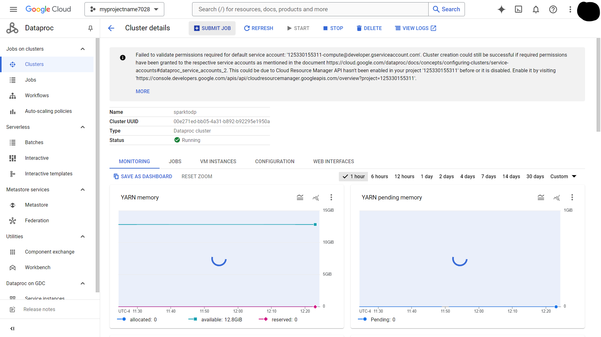

# Spark Job Migration from HDFS-to-Dataproc and GCS.

Overview
In project we will migrate Apache Spark code to Cloud Dataproc. 

We will follow a sequence of steps progressively moving more of the job components over to Google Cloud services:

1.  Run original Spark code on Cloud Dataproc (Lift and Shift)
2.  Replace HDFS with Cloud Storage (cloud-native)
3.  Automate everything so it runs on job-specific clusters (cloud-optimized)

## Objective 

* Migrate existing Spark jobs to Cloud Dataproc.
* Modify Spark jobs to use Cloud Storage instead of HDFS.
* Optimize Spark jobs to run on Job specific clusters.

## Scenario

You are migrating an existing Spark workload to Cloud Dataproc and then progressively modifying the Spark code to make use of Google Cloud native features and services.

## Task 1. Migrate existing Spark jobs to Cloud Dataproc : Lift and shift

You will create a new Cloud Dataproc cluster and then run an imported Jupyter notebook that uses the cluster's default local Hadoop Distributed File system (HDFS) to store source data and then process that data just as you would on any Hadoop cluster using Spark. 

This demonstrates how many existing analytics workloads such as Jupyter notebooks containing Spark code require no changes when they are migrated to a Cloud Dataproc environment.

### STEP 1 : Configure and start a Cloud Dataproc cluster

Below I have attached details of cluster created using GCP cloud console window.

* Versioning : 2.1 (Debian 11, Hadoop 3.3, Spark 3.3)
* Enable component gateway : True
* Optional components :  Jupyter Notebook
----------
* Manager node Series : E2 and 
* Manager node Machine Type : e2-standard-2 (2 vCPU, 8 GB memory) 
* Manager node Disk Size : Primary disk size 30
------
* Worker node Series : E2 and 
* Worker node Machine Type : e2-standard-2 (2 vCPU, 8 GB memory) 
* Worker node Disk Size : Primary disk size 30


    

### STEP 2 : Clone the source repository

We will clone the Git repository **and** copy the required notebook files to the Cloud Storage bucket used by Cloud Dataproc as the home directory for Jupyter notebooks.

1.  Setup code 

```bash
gcloud auth login
gcloud config set project myprojectid7028
```
2.  Code to clone Git repository

```bash
git -C ~ clone https://github.com/GoogleCloudPlatform/training-data-analyst
```

3.  Locate the default Cloud Storage bucket used by **Cloud Dataproc**.

```bash
export DP_STORAGE="gs://$(gcloud dataproc clusters describe sparktodp --region=us-central1 --format=json | jq -r '.config.configBucket')"
```

4.  Fetching cloud Storage bucket path 

```bash
username@cloudshell:~ (myprojectid7028)$ echo $DP_STORAGE
gs://dataproc-staging-us-central1-125330155311-nluu0drg
```

5.  Copy the sample notebooks from cloud shell storage into the Jupyter working folder in dataproc's cloud storage.

```bash
gcloud storage cp ~/training-data-analyst/quests/sparktobq/*.ipynb $DP_STORAGE/notebooks/jupyter
```

### STEP 3 : Log in to the Jupyter Notebook

By clicking on Jupyter notebook on dataproc cluster it will take to jupyter enviornment. 

Now we will exceuting ***01_spark.ipynb*** Notebook their. 


## Task 2. Separate compute and storage

*  Now we will Modify Spark jobs to use Cloud Storage instead of HDFS.

*   We will create a copy that decouples the storage requirements for the job from the compute requirements. 

*   We will also replace the Hadoop file system calls with Cloud Storage calls by replacing hdfs:// storage references with gs:// references in the code and adjusting folder names as necessary.


### STEP 1

create a new storage bucket for your source data 
Here Keeping Name of the bucket is similar to project id
```bash
export PROJECT_ID=$(gcloud info --format='value(config.project)')

gcloud storage buckets create gs://$PROJECT_ID
```

### STEP 2
Downloading data in cloud shell storage.


```bash
wget https://storage.googleapis.com/cloud-training/dataengineering/lab_assets/sparklab/kddcup.data_10_percent.gz
```

### STEP 3
Copying data from cloud shell storage to gcloud bucket *myprojectid7028*

```bash
gcloud storage cp kddcup.data_10_percent.gz gs://$PROJECT_ID/
```
### STEP 4
Now we will make small code change is our exiting ***01_spark.ipynb*** and will make copy of it with name ***De-couple-storage.ipynb***

OLD Code with HDFS storage 

```python

from pyspark.sql import SparkSession, SQLContext, Row

spark = SparkSession.builder.appName("kdd").getOrCreate()
sc = spark.sparkContext
data_file = "hdfs:///kddcup.data_10_percent.gz"
raw_rdd = sc.textFile(data_file).cache()
raw_rdd.take(5)

```

NEW code replacement for Google cloud storage.

```python
from pyspark.sql import SparkSession, SQLContext, Row

gcs_bucket='myprojectid7028'
spark = SparkSession.builder.appName("kdd").getOrCreate()
sc = spark.sparkContext
data_file = "gs://"+gcs_bucket+"//kddcup.data_10_percent.gz"
raw_rdd = sc.textFile(data_file).cache()
raw_rdd.take(5)
```

We can see only we only added location changes their.

### STEP 4

Run the Entire Notebook "***De-couple-storage.ipynb***".


## Task 3. Deploy Spark jobs : Optimize Spark jobs to run on Job specific clusters


Now we will create a standalone Python file, that can be deployed as a Cloud Dataproc Job, that will perform the same functions as this notebook. 

We will use *add magic* commands to the Python cells in a copy of this notebook to write the cell contents out to a file. 

We will also add an input parameter handler to set the storage bucket location when the Python script is called to make the code more portable.


### STEP 1 : Test Automation from Jupyter Notebook
You now test that the PySpark code runs successfully as a file by calling the local copy from inside the notebook, passing in a parameter to identify the storage bucket you created earlier that stores the input data for this job. The same bucket will be used to store the report data files produced by the script.

Refer Code File name : **PySpark-analysis-file.ipynb**

In this notbook we ran job from jupyter notbook by creating .py python file from jupyter notebook.

### STEP 2 : Run the Analysis Job from Cloud Shell.

Now we will run this job from cloud shell

copy the Python script from Cloud Storage so you can run it as a Cloud Dataproc Job

```bash
gcloud storage cp gs://$PROJECT_ID/sparktodp/spark_analysis.py spark_analysis.py
```

Create a launch script:

```bash
nano submit_onejob.sh
```

```bash
#!/bin/bash
gcloud dataproc jobs submit pyspark \
       --cluster sparktodp \
       --region REGION \
       spark_analysis.py \
       -- --bucket=$1
```

Make the script executable:
```bash
chmod +x submit_onejob.sh
```

Launch the PySpark Analysis job:
```bash
./submit_onejob.sh $PROJECT_ID
```

```
#!/bin/bash
gcloud dataproc jobs submit pyspark \
       --cluster sparktodp \
       --region REGION \
       spark_analysis.py \
       -- --bucket=$1
```

Make the script executable:

```bash
chmod +x submit_onejob.sh

```

Launch the PySpark Analysis job

```bash
./submit_onejob.sh $PROJECT_ID
```
We can job sucessfully launched.


